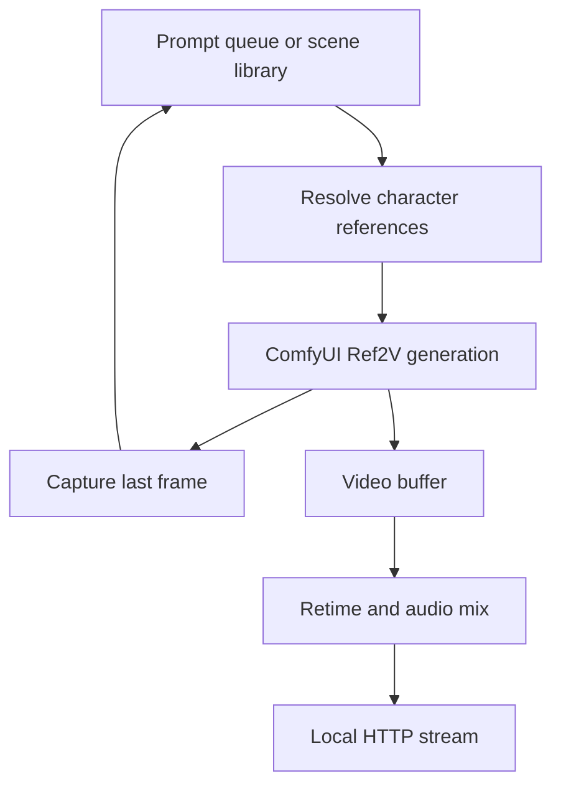

# FastH3 Ref2V Continuity Stream Controller

Local Windows/ComfyUI controller for continuous MiniMax H3 reference-to-video
generation. It turns short Ref2V clips into a viewer-aware HTTP stream and adds
live prompt control, character references, story continuation, LoRAs, adaptive
quality, optional SageAttention, and a continuous external music bed.

> This is an add-on for
> [`jacokon/fasth3-live`](https://huggingface.co/datasets/jacokon/fasth3-live),
> not an official MiniMax, ComfyUI, or FastH3 release.

[Deutsche Dokumentation](README_DE.md)

## Highlights

- Configurable short, four-step MiniMax H3 Ref2V clips
- Real `<Picture N>` character references from filenames
- Last-frame story continuation between automatic and manual prompts
- Browser control UI with start/pause, prompt queue, editing, and repeat
- English/German UI switch, with English as the default
- Random or ordered playback of the scene text file
- Live refresh buttons for scene prompts and character references
- Live H3 clip duration with automatic stream-duration recalculation
- Runtime Model-only LoRA selection and weight changes
- Viewer detection and disk-backed prebuffering
- Adaptive 448×448 / 800×800 generation based on buffer depth
- Stable guide-only continuation mode to reduce recursive color drift
- Continuous file/folder music playlist, ordered or random, with optional ducking
- Attention backend selection with safe SageAttention fallback
- Local HTTP MPEG-TS output for VLC

## Scope of this package

The add-on archive contains every small source file introduced by this project:

| File | Purpose |
| --- | --- |
| `stream_h3_r2v_continuity.py` | Generator, queue, control API, stream and audio mixer |
| `start_h3_r2v_continuity.ps1` | Desktop/Portable launcher and custom-node installer |
| `MiniMaxH3_R2V_4step_5s.json` | Tested Ref2V workflow template |
| `custom_nodes/h3_r2v_fixed/` | Fixed image sockets for reliable API submission |
| `check_sageattention.ps1` | SageAttention compatibility check |
| `README.md` / `README_DE.md` | Documentation |
| `.gitignore` | Excludes private media, runtime state, and generated clips |

It intentionally does **not** duplicate large or separately licensed upstream
assets. You still need:

- `submit_h3.py`, `prompts_scenes.txt`, and `h3_characters.json` from
  `jacokon/fasth3-live`;
- `custom_nodes/h3_fast_writer` from that repository for the default writer;
- optionally `custom_nodes/h3_block_attention` from that repository;
- a current ComfyUI installation with MiniMax H3 core nodes;
- the Ref2V model, text encoder, video/audio VAEs, and four-step Ref2V LoRA;
- FFmpeg and FFprobe;
- your own reference images and optional music files.

The launcher copies all three custom-node directories into ComfyUI when they
are present in the merged folder. Model weights and media are never included.

## License warning

The controller source, its custom node, workflow template, and project
documentation are intended to be distributed under the **GNU General Public
License v3.0 only (GPL-3.0-only)**. Add GitHub's `GNU General Public License
v3.0` template as the repository's root `LICENSE` file. Recipients may use,
study, modify, redistribute, and use the code commercially, but distributed
modified versions must remain under the GPL and include source code.

This project license covers only files you own in this add-on. It does not
relicense MiniMax models, upstream FastH3 files, music, character references,
or any other third-party assets.

The upstream FastH3 dataset is gated and its page currently states that its
model derivative is subject to the MiniMax H3 Community License, including
territory restrictions. Review and accept the current upstream terms yourself
before downloading or redistributing anything. Do not upload model weights,
third-party reference images, generated celebrity datasets, or upstream files
to GitHub unless their licenses explicitly permit it.

This controller does not bypass the gate and does not download weights.

## Requirements

- Windows 10/11
- Comfy Desktop or ComfyUI Portable with a recent MiniMax H3 implementation
- NVIDIA GPU with enough VRAM for the chosen model and resolution
- Python supplied by ComfyUI
- FFmpeg build containing `rubberband`, plus FFprobe
- The downloaded `jacokon/fasth3-live` repository

The launcher detects both current Comfy Desktop defaults and the established
ComfyUI Portable layout automatically. Current Comfy Desktop normally uses:

```text
%LOCALAPPDATA%\Comfy-Desktop\
├── ComfyUI-Installs\
│   └── <installation>\
│       ├── .venv\Scripts\python.exe
│       └── ComfyUI\custom_nodes\
└── ComfyUI-Shared\
    ├── input\
    ├── output\
    └── models\
```

Portable is still detected when `fasth3-live` is directly beside the `ComfyUI`
and `python_embeded` directories. The project folder itself may live anywhere
with Comfy Desktop; `prompts_scenes.txt` and `character_refs` default to files
beside the controller script.

For a custom installation or to select one of several Desktop installations,
set these variables before starting:

```powershell
$env:COMFYUI_ROOT = "$env:LOCALAPPDATA\Comfy-Desktop\ComfyUI-Installs\<installation>\ComfyUI"
$env:COMFYUI_DATA_ROOT = "$env:LOCALAPPDATA\Comfy-Desktop\ComfyUI-Shared"
$env:COMFYUI_PYTHON = "$env:LOCALAPPDATA\Comfy-Desktop\ComfyUI-Installs\<installation>\.venv\Scripts\python.exe"
```

## Required models

Place these files in the standard ComfyUI model folders. For current Comfy
Desktop that base is `%LOCALAPPDATA%\Comfy-Desktop\ComfyUI-Shared\models`;
Portable uses `ComfyUI\models`:

```text
<ComfyUI data>\models\
├── diffusion_models\
│   └── minimax_h3_ref2va_pruned_int8_convrot.safetensors
├── text_encoders\
│   └── qwen3vl_32b_minimax_h3_nvfp4_awq.safetensors
├── vae\
│   ├── minimax_h3_video_vae_fp16.safetensors
│   └── minimax_h3_audio_vae_fp32.safetensors
└── loras\
    └── minimax_h3_ref2v_turbo_4step_v0.1_comfyui_bf16.safetensors
```

The workflow uses Ref2VA weights, not the FL2VA FastH3 weights from the original
text-to-video stream. Model filenames can be overridden through CLI options.

## Installation

1. Download and extract the complete gated `jacokon/fasth3-live` repository
   into any writable folder.
2. Extract this add-on and copy the **contents** of `h3-r2v-continuity` into the
   existing `fasth3-live` directory. Keep all upstream files.
3. Install FFmpeg if it is not already available:

   ```powershell
   winget install -e --id Gyan.FFmpeg
   ```

4. Close and reopen PowerShell, then verify:

   ```powershell
   ffmpeg -version
   ffprobe -version
   ```

5. Start ComfyUI and wait until `http://127.0.0.1:8188` is ready.
6. Run the controller once:

   ```powershell
   powershell.exe -NoProfile -ExecutionPolicy Bypass `
     -File "C:\path\to\fasth3-live\start_h3_r2v_continuity.ps1"
   ```

7. If the launcher installs or updates custom nodes, restart ComfyUI completely
   and run the same command again.

The launcher installs these nodes when their source directories exist:

- `h3_r2v_fixed` from this add-on;
- `h3_fast_writer` from the upstream repository;
- `h3_block_attention` from upstream, when available.

At startup it prints the detected ComfyUI core, shared data directory and
Python executable. Comfy Desktop's current LocalAppData locations, its older
home-directory layout, and the portable layout are supported.

## Open the interfaces

- Control UI: <http://127.0.0.1:9001>
- VLC network stream: <http://127.0.0.1:9000>

In VLC, use **Media → Open Network Stream** and enter the stream URL.

The control UI starts in English. Choose **Deutsch** from the language selector
to switch immediately; the selection is persisted in the runtime config. This
changes the controller interface, not the language of authored prompts.

## How it works



By default H3 generates 124 frames at its native 24 fps. The stream presents
them at 14 fps, making the default clip about 8.86 seconds long. Video and
native H3 audio are retimed together before the clip enters the paced MPEG-TS
stream. Both generated duration and resulting playback duration are shown in
the UI.

## Character references

Create or select a `character_refs` directory and name files after their aliases:

```text
character_refs\
├── jane.png
├── john.png
└── guard.webp
```

Supported image extensions are PNG, JPG/JPEG, and WebP. Matching is
case-insensitive and uses complete aliases, so `ben.png` does not match
`bench`.

Prompt:

```text
Jane opens the old letter while John watches the doorway.
```

Submitted Ref2V prompt:

```text
Jane <Picture 1> opens the old letter while John <Picture 2> watches the doorway.
```

Up to nine image references are supported. With an active story, character
references from the previous successful clip are carried into automatic scenes
that do not explicitly name a new character.

## Story continuation

The default **Guide only** mode extracts the last usable frame and feeds it to
`MiniMaxH3AddGuide` as frame zero of the next clip. The controller prepends a
continuation instruction to both manual and automatic prompts.

Modes:

| Mode | Behavior | Trade-off |
| --- | --- | --- |
| Guide only | Last frame is a frame-zero guide | More stable color and contrast |
| Guide + Picture | Last frame is also a Ref2V picture token | Stronger binding, more recursive drift |

Use **New story / Reset** in the UI when color, contrast, composition, or facial
errors begin to accumulate. Guide-only reduces drift but cannot eliminate error
accumulation across an unlimited recursive chain.

Continuity requires serial generation because the next prompt cannot be built
until the previous final frame exists. Disabling continuity allows `--pipeline`
parallel queueing again.

## Manual prompts and repeat

The UI can insert a prompt as the next item or append it to the manual queue.
Queued prompts can be edited, moved, deleted, and marked **Repeat**.

- One repeat prompt loops indefinitely.
- Multiple repeat prompts rotate in queue order.
- Disable repeat or delete an item to stop it.
- A job already submitted to ComfyUI cannot be recalled.

A short description is enough:

```text
Jane picks up the letter, reads the first line and looks toward the closed door.
```

The controller adds the H3 prompt sections automatically. For authored full
prompts, shots whose timestamps start after the selected native clip length are
removed before submission.

## Scene-file playback and refresh

The scene source can run in either mode:

- **Random** selects a random block from `prompts_scenes.txt`.
- **In order** starts at the first block, advances sequentially, and wraps at
  the end.

Scene blocks are separated by a line containing `---`. The file is re-read for
each new automatic prompt. **Refresh prompts** validates the currently entered
path and deliberately resets the ordered cursor to the first scene. Manual
queue items always take priority over the scene file.

**Refresh references** immediately rescans the currently entered
`character_refs` path. References are also scanned before each submission, so
the button is primarily an explicit validation and status refresh.

## Dynamic clip duration

The UI accepts a native generation duration from about 0.92 to 15.08 seconds.
MiniMax H3 supports frame counts in the sequence `17k + 5`, so the entered time
is snapped to the nearest valid frame count and the exact result is displayed.

For example at the default 14 fps stream speed:

| Requested | H3 frames | Native duration | Stream duration |
| ---: | ---: | ---: | ---: |
| 5 s | 124 | 5.17 s | 8.86 s |
| 10 s | 243 | 10.13 s | 17.36 s |
| 15 s | 362 | 15.08 s | 25.86 s |

The selected length is stored with every submitted job. This matters when the
buffer contains clips made with different settings: each one is retimed and
timestamped using its own frame count. Throughput reporting also uses frames
per generation second instead of assuming one fixed duration. Changes affect
the next not-yet-submitted job.

## LoRAs

The browser UI lists Model-only LoRAs reported by ComfyUI and supports up to
eight live entries with individual strengths. Changes affect the next
not-yet-submitted job.

The four-step Ref2V Turbo LoRA is already part of the supplied workflow. Do not
add the same Turbo LoRA again in the live list.

## Viewer detection and adaptive quality

For the built-in HTTP target, the controller counts connected stream clients.
When no viewer is connected, playback pauses after the current clip while
generation fills the file buffer up to `--queue-max`.

Default adaptive profile:

| State | Resolution |
| --- | --- |
| Buffer 0–3 | 448×448 |
| Buffer 4 or more | 800×800 |

Separate high and low thresholds provide hysteresis. Generated clips are scaled
onto one fixed stream canvas so VLC does not receive mid-stream resolution
changes. Changing the render dimensions is live; changing the fixed stream
canvas requires a controller restart.

## Audio and continuous music

Native H3 dialogue, ambience, and effects are preserved. Because the default
14 fps output stretches native audio to about 58 percent tempo, H3-generated
music can sound warped. The recommended mode is:

```text
External music:          enabled
Music volume:            0.20
H3 audio volume:         1.00
Ducking:                 enabled for dialogue-heavy scenes
Suppress H3 music:       enabled
```

Select either one audio file or a folder in the UI. Supported folder entries
are MP3, WAV, FLAC, M4A, AAC, OGG, and Opus. A single file loops continuously.
A folder can play alphabetically by filename or in randomized cycles. Random
cycles avoid immediately repeating the last track when possible.

The playlist retains its exact position across clip boundaries. If a track
ends inside a video clip, the next selected track is joined within that same
clip. Volume, source, and playback-mode changes apply to the next played clip.

**Suppress H3 music** rewrites only `non_diegetic_music` to `N/A`; it does not
remove `overall_soundscape`. Prompt-policy changes affect the next submitted
job, so already buffered clips may still contain previously generated music.

Ducking reacts to all H3 audio, not only recognized speech. Turn it off for
constant music level or ambience-heavy prompts.

## Attention and SageAttention

`auto` selects the fastest backend that ComfyUI actually reports, preferring:

1. SageAttention
2. Comfy Kitchen attention
3. PyTorch attention

The controller never submits the string `sage attention` unless that exact
backend is present in ComfyUI's `/object_info`, avoiding validation errors.

Run the compatibility check with:

```powershell
powershell.exe -NoProfile -ExecutionPolicy Bypass `
  -File ".\check_sageattention.ps1"
```

SageAttention is optional. Install only a wheel matching the exact Python,
PyTorch, CUDA, and Windows ABI of the active ComfyUI environment. A failed or absent
Sage installation falls back safely.

## Useful command-line options

Pass options after the launcher path:

```powershell
powershell.exe -NoProfile -ExecutionPolicy Bypass `
  -File ".\start_h3_r2v_continuity.ps1" `
  --fps 14 --prefill 3 --queue-max 8 --vbitrate 4M
```

Common options:

| Option | Default | Meaning |
| --- | ---: | --- |
| `--fps` | `14` | Stream playback fps and retiming ratio |
| `--prefill` | `3` | Clips required before playback setup |
| `--queue-max` | `8` | Maximum finished clip buffer |
| `--writer` | `h3fast` | Intermediate clip writer |
| `--ref-image-size` | `match` | `match` is faster; `max` may improve identity |
| `--vbitrate` | `4M` | Fixed-canvas H.264 bitrate |
| `--keep-clips` | off | Retain generated clips for diagnostics |
| `--max-clips N` | `0` | Stop after N played clips; zero means unlimited |
| `--music PATH` | `music.mp3` | Initial music path shown in the UI |

Run `python stream_h3_r2v_continuity.py --help` through the portable Python for
the complete list.

## Troubleshooting

### PowerShell blocks the launcher

Use the documented one-process bypass:

```powershell
powershell.exe -NoProfile -ExecutionPolicy Bypass -File ".\start_h3_r2v_continuity.ps1"
```

This does not change the machine-wide execution policy.

### The process continues only after pressing Enter

The legacy Windows console can pause a process when text-selection/QuickEdit
mode is active. Pressing Enter exits selection mode. Avoid clicking or dragging
inside that console, disable QuickEdit in its properties, or run the process in
Windows Terminal.

### `H3FastWriteVideo` is missing

Make sure the complete upstream `custom_nodes/h3_fast_writer` directory exists
inside `fasth3-live`, run the launcher once, restart ComfyUI, and run it again.

For diagnostics only, `--writer savevideo` uses the stock writer but is slower.

### `H3ReferenceToVideoFixed` or `MiniMaxH3AddGuide` is missing

Run the launcher once and restart ComfyUI. If `MiniMaxH3AddGuide` is still
missing, update ComfyUI to a version containing the current MiniMax H3 nodes.

### `ref_image_size` is missing

Use the workflow included with this package and update the fixed node by running
the launcher. Older API-converted workflows may omit the required field.

### `sage attention` fails prompt validation

Leave the UI setting on `auto`. It will choose only a backend advertised by the
running ComfyUI instance.

### SAM3D warnings

SAM3D is unrelated to this workflow. A warning from another installed custom
node does not require SAM3D installation unless the prompt has a separate H3
validation or execution error.

### Stream has no audio

- Verify `ffmpeg -version` and `ffprobe -version` in a newly opened PowerShell.
- Confirm the music file exists when external music is enabled.
- Set H3 audio volume above zero.
- Inspect raw output with `--keep-clips` to distinguish H3 generation from the
  streaming mix.

### Generation is slower than playback

Compare the trailing generation average in the terminal with clip playback
duration. Lower `--fps`, increase the prebuffer, reduce HQ resolution, or raise
the HQ threshold. One unusually slow cold start is excluded from the throughput
average.

## Security and networking

The default control and stream servers bind to `127.0.0.1` and are reachable
only from the same computer. The control API has no authentication. Do not bind
it to a public interface without adding access control and network filtering.

## Publishing checklist

- Publish source and documentation, not model weights.
- Preserve the upstream `LICENSE`, `NOTICE`, and MiniMax license files.
- Clearly identify this project as an unofficial add-on.
- Do not include personal character images, music, generated clips, paths, or
  `h3_r2v_continuity.json` in commits.
- Add `character_refs/`, `music.*`, `stream_tmp/`, and generated config files to
  `.gitignore`.
- Link users to the gated upstream repository so they accept its terms directly.

## Acknowledgements

- [`jacokon/fasth3-live`](https://huggingface.co/datasets/jacokon/fasth3-live)
- [ComfyUI](https://github.com/Comfy-Org/ComfyUI)
- [Comfy-Org/MiniMax-H3](https://huggingface.co/Comfy-Org/MiniMax-H3)
- [FFmpeg](https://ffmpeg.org/)
